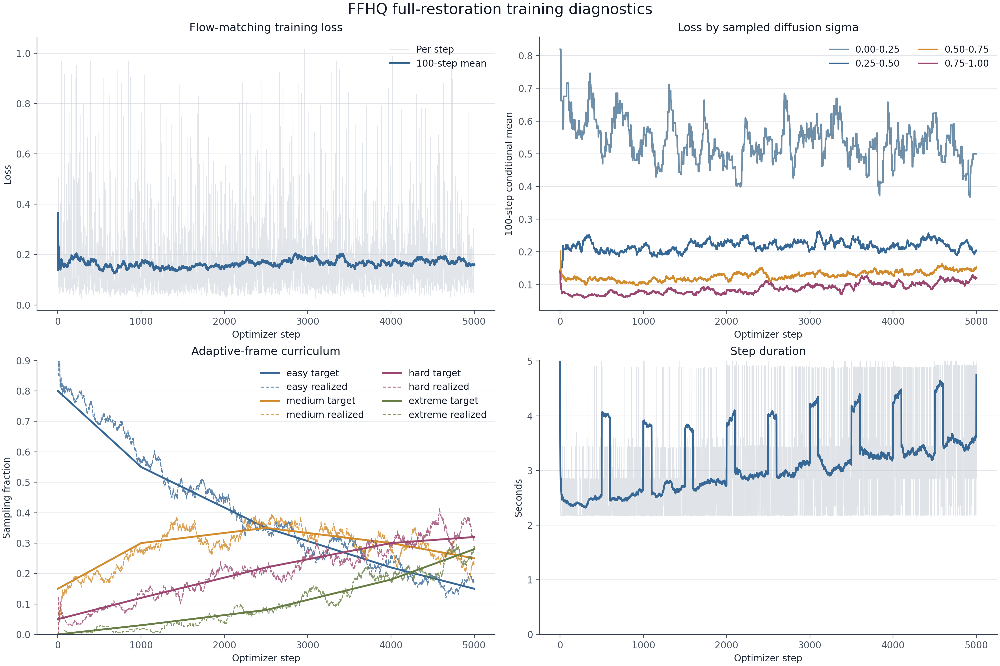

# LTX-2.5 video restoration experiments

This repository contains supervised video-restoration experiments under `degradation_undoing/`, including FFHQ face depixelation and COCO natural-image restoration. The experiments fine-tune a frozen LTX-2.5 video model with LoRA to map a degraded first frame through a sequence of progressively cleaner frames.

The saved runs show measurable FFHQ improvements on a small held-out set, while the COCO validation metrics disagree: perceptual metrics improved, but pixel-error metrics did not. The project is a research prototype, and broad restoration quality or identity preservation has not been established.



## What the code does

- Uses a frozen LTX-2.5 distilled 22B transformer and a rank-64 LoRA adapter in BF16.
- Conditions the model on a degraded image in the first frame and supervises the full degraded-to-clean video trajectory.
- Applies JPEG compression, Gaussian blur, nearest-neighbor pixelation, bicubic low-resolution degradation, and mixed corruptions.
- Uses 17, 25, 33, or 49 RGB frames at 512 by 512 pixels and 24 frames per second, selected by restoration difficulty. With the LTX temporal VAE, these frame counts correspond to 3, 4, 5, or 7 latent frames.
- Builds deterministic train, validation, and test manifests, precomputes LTX latents and conditions, checks cached tensors and split isolation, and gates full runs on a bounded optimizer smoke test.
- Saves resumable training state, periodic adapters, and fixed-seed validation videos. The launchers can report progress and failures through Telegram.

The LoRA targets cover self-attention, cross-attention, and feed-forward projections. The experiment uses supervised flow matching; it is not GAN training and it does not claim that texture synthesized from heavily degraded inputs is ground-truth recovery.

## Preserved runs and results

Four full training runs are recorded as complete in their local `run_state.json` files:

| Run | Training plan | Evaluation evidence |
| --- | --- | --- |
| FFHQ moderate curriculum | 6,000 steps | Training and fixed validation videos |
| FFHQ aggressive continuation | 5,000 additional steps, initialized from the moderate adapter | Training and fixed validation videos |
| FFHQ full restoration | 5,000 steps, initialized from the aggressive adapter | Ten deterministic held-out identities at extreme corruption; fixed validation videos and checkpoint comparison |
| COCO aggressive 49-frame continuation | 8,000 steps | One fixed clean validation image rendered at three corruption tiers |

### FFHQ full-restoration held-out sample

The 10 held-out identities are disjoint from training and validation, with two examples for each corruption family. The table reports the mean of the same deterministic inputs before and after restoration:

| Output | MSE ↓ | PSNR (dB) ↑ | MS-SSIM ↑ | LPIPS ↓ |
| --- | ---: | ---: | ---: | ---: |
| Degraded input | 0.005927 | 24.011 | 0.7755 | 0.5512 |
| Checkpoint at step 3,500 | 0.004157 | 25.139 | 0.8528 | 0.2949 |
| Checkpoint at step 5,000 | 0.004053 | 25.251 | 0.8540 | 0.2975 |

At step 5,000, all 10 examples improved over their degraded inputs on each of these four metrics. A paired bootstrap over those 10 examples gives 95% intervals for the mean change versus degraded input: MSE −0.00187 [−0.00329, −0.00067], PSNR +1.24 dB [+0.76, +1.76], MS-SSIM +0.0786 [+0.0479, +0.1141], and LPIPS −0.2537 [−0.2826, −0.2242]. Step 3,500 has a slightly lower mean LPIPS than step 5,000, so the preferred checkpoint depends on the metric. Ten face images are a sanity check, not a general benchmark; the work does not yet measure identity preservation or prove that details absent from the input are recovered faithfully.

### COCO 49-frame validation

The preserved COCO analysis covers one fixed clean validation image across easy, medium, and hard degradation settings. The best mean PSNR was at step 6,000 (17.93 dB) versus 18.06 dB for the degraded input; MSE was also worse (0.01644 versus 0.01578). MS-SSIM and LPIPS improved at that checkpoint (0.561 versus 0.507 and 0.535 versus 0.643). The single-image, three-tier validation and disagreement between metrics leave natural-image performance unresolved.

These results are descriptive for the saved runs. They do not establish performance across random seeds, datasets, or unseen corruption distributions. Severe degradation also makes plausible generated detail different from verified recovery of the original image.

## Repository layout

- `configs/`: experiment configurations.
- `data_gen/`: deterministic manifests, corruption operators, trajectory builders, latent precomputation, and cache validators.
- `train/`: FFHQ and COCO LTX trainer entry points.
- `restoration/`: shared data, LoRA, and training utilities.
- `inference/`: inference helpers.
- `evaluation/`: held-out evaluation and analysis scripts.
- `readiness/`: environment, data, launch, and smoke-test gates.
- `tests/`: CPU-sized tests for configuration, curriculum, corruption, trajectories, LTX schedule handling, and LoRA safety.
- `FFHQ_*.md`: experiment-specific run plans and launch notes.
- `docs/training-diagnostics.png`: a compact plot copied from the completed FFHQ paper package.

The local `data/` and `outputs/` trees contain hundreds of gigabytes of datasets, precomputed latents, videos, logs, and checkpoints. They stay on the DGX and are excluded from this repository. The plotted diagnostics are the only experiment output copied into the repository; the source package and result files remain on the DGX.

## Runtime requirements

The launchers target the DGX Spark environment already provisioned for this project:

- Python environment: `/home/boni/ai/envs/dgx-dl`
- LTX source checkout: `/home/boni/projects/video_training/LTX-2-v1.3.0`
- LTX-2.5 distilled model, video VAE, and LTX-tuned Gemma text encoder in the Hugging Face model cache
- CUDA/BF16-capable GPU, sufficient unified memory and disk space for the latent cache and checkpoints

`project_config.py` currently contains DGX-specific paths and dataset roots (`/mnt/hdd/ffhq` and `/mnt/hdd/coco2017`). This is not a portable pip-only package: install and validate the compatible LTX stack and gated model files on the DGX before running. The dataset files and model weights are not redistributed here; access to the datasets and Hugging Face model terms may be required.

## Run on the DGX

Connect to the Spark, enter the project directory, activate the existing environment, and run the fail-closed launcher for the experiment you want:

```bash
ssh dgx-spark
cd /home/boni/projects/video_training/degradation_undoing
source /home/boni/ai/envs/dgx-dl/bin/activate

./run_ffhq_overnight.sh
./run_ffhq_aggressive_overnight.sh
./run_ffhq_full_restoration_overnight.sh
./run_coco_aggressive_49_overnight.sh
```

Each launcher creates a detached `tmux` session and returns. The run-plan files (`FFHQ_OVERNIGHT.md`, `FFHQ_AGGRESSIVE_OVERNIGHT.md`, and `FFHQ_FULL_RESTORATION.md`) describe the corresponding data splits, curriculum, monitoring commands, and safeguards. `run_somfaces_isolated.sh` is a separate, narrowly scoped evaluation launcher.

Set `TELEGRAM_BOT_TOKEN` and `TELEGRAM_CHAT_ID` in the shell before launch if Telegram progress reporting is desired. Do not put those values in project files. The scripts check dependencies, local model files, GPU availability, memory and disk conditions, and data/cache integrity before they start long work. Training commands can run for hours and write large checkpoints to `outputs/`.

## Tests and evaluation

The repository includes bounded unit tests. On the configured DGX environment, run:

```bash
cd /home/boni/projects/video_training/degradation_undoing
source /home/boni/ai/envs/dgx-dl/bin/activate
PYTHONPATH=. pytest -q
```

This documentation pass did not run tests, data generation, GPU smoke checks, or training. Existing run-state, metrics, and paper-package files were inspected as read-only evidence. For complete historical results, inspect the ignored local `outputs/` tree, especially `outputs/ffhq_full_restoration/paper_package_20260904/` and `outputs/coco_pixel_aggressive_49/analysis/`.

## Data and artifact handling

The `.gitignore` excludes only project data/output/log/cache trees and common model/video checkpoint formats. It does not delete any files. Before publishing additional artifacts, check that they contain no local dataset, identity manifest, source face, model weight, or secret. Keep bulky or restricted data on the DGX and publish compact, cleared figures or metrics summaries instead.
